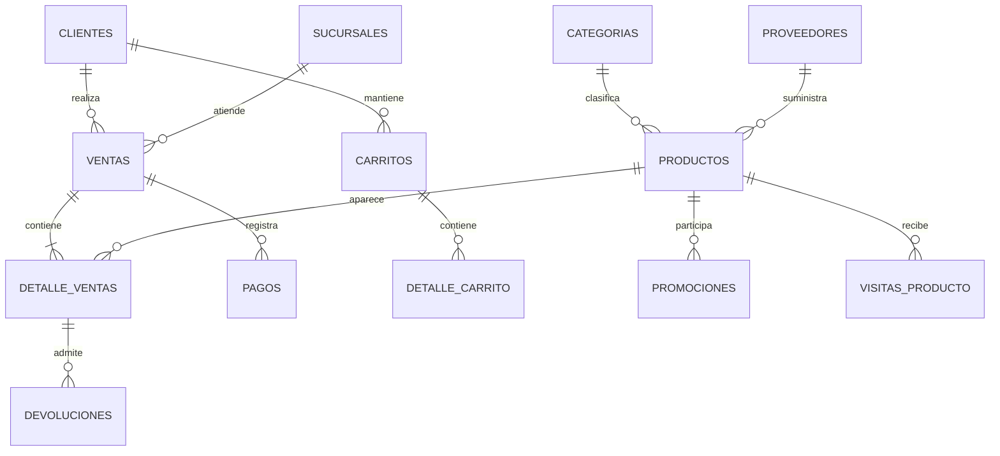

# Proyecto de Base de Datos para un E-commerce

Base de datos academica para gestionar catalogo, clientes, inventario, pedidos,
pagos simulados y devoluciones. Incluye analisis de ventas, funciones reutilizables,
control de permisos, auditoria de operaciones y mantenimiento programado.

## Integrantes y entrega

- Integrante: **Santiago Castro** (trabajo individual).
- Nombre de equipo para la entrega: **SantiagoCastro**.
- Nombre propuesto del repositorio privado: `Proyecto_BD_Avanzada_SantiagoCastro`.
- Colaborador trainer: **PENDIENTE: usuario de GitHub proporcionado por el trainer**.
- Datos: sinteticos creados para esta entrega; no se recibio un conjunto estandarizado del trainer.

## Entorno

- MySQL Community Server **8.4 LTS**, probado con **8.4.11**, InnoDB.
- No compatible directamente con SQLite, PostgreSQL, SQL Server ni MariaDB.
- Visual Studio Code es el editor; MySQL Server ejecuta los scripts.
- Usuario DBA (`root` local) para crear esquema, roles, usuarios, rutinas y eventos.
- Todos los archivos SQL estan en la raiz. No requieren una aplicacion web.
- Datos y eventos usan UTC. Todas las cantidades monetarias usan una misma moneda
  academica; IVA, envio, cambios de moneda y lealtad tienen reglas de demostracion.
- El proyecto usa el esquema `ecommerce` y cuentas locales con los nombres del enunciado.
  Ejecutar en un servidor de desarrollo donde no existan esos objetos.

## Archivos

| Archivo | Contenido |
| --- | --- |
| `01_Esquema_y_Datos.sql` | Esquema, tablas auxiliares y datos sinteticos |
| `02_Consultas_Avanzadas.sql` | Las 20 preguntas de negocio, numeradas |
| `03_Funciones.sql` | 20 funciones |
| `04_Seguridad.sql` | 7 roles, 7 usuarios, vistas y permisos |
| `05_Triggers.sql` | 20 triggers solicitados y 3 complementos de integridad |
| `06_Eventos.sql` | 20 eventos; deshabilitados inicialmente |
| `07_Procedimientos_Almacenados.sql` | 20 procedimientos y permisos de ejecucion |

Excepciones necesarias al reparto del enunciado: `log_cambios_precio` se crea en 05
y `reporte_ventas_semanales` en 06, tal como pide su descripcion especifica. Los
permisos sobre esos logs se conceden en 05 y los permisos de ejecucion en 07 porque
los objetos todavia no existen al ejecutar 04. El resto de tablas se crea en 01.

Los identificadores usan ASCII: `contrasena_hash`,
`fn_ValidarComplejidadContrasena` y `sp_AnadirResenaProducto` son los equivalentes
de los nombres con caracteres acentuados del enunciado.

## Instalacion paso a paso

1. Abrir la carpeta del proyecto en Visual Studio Code.
2. En una terminal PowerShell, conectarse con el cliente instalado:

```powershell
& "C:\Program Files\MySQL\MySQL Server 8.4\bin\mysql.exe" --default-character-set=utf8mb4 -u root -p
```

3. Introducir la contrasena de root cuando se solicite. No incluirla en los archivos.
4. Dentro de `mysql>`, ejecutar **cada linea por separado y en orden**:

```sql
SOURCE C:/Users/usuario/Documents/Campus/Proyecto MySQL/01_Esquema_y_Datos.sql;
SOURCE C:/Users/usuario/Documents/Campus/Proyecto MySQL/02_Consultas_Avanzadas.sql;
SOURCE C:/Users/usuario/Documents/Campus/Proyecto MySQL/03_Funciones.sql;
SOURCE C:/Users/usuario/Documents/Campus/Proyecto MySQL/04_Seguridad.sql;
SOURCE C:/Users/usuario/Documents/Campus/Proyecto MySQL/05_Triggers.sql;
SOURCE C:/Users/usuario/Documents/Campus/Proyecto MySQL/06_Eventos.sql;
SOURCE C:/Users/usuario/Documents/Campus/Proyecto MySQL/07_Procedimientos_Almacenados.sql;
```

Para el trainer: sustituir la ruta por la carpeta clonada, conservando el orden.
Tambien puede abrir el cliente desde la raiz y usar `SOURCE 01_Esquema_y_Datos.sql;`, etc.
El comando SOURCE admite espacios en la ruta: usar barras `/` y no comillas.

Si aparece `ERROR`, detenerse y resolverlo antes del archivo siguiente. El cliente
interactivo puede seguir leyendo un SOURCE despues de un error: la ausencia de un
error al final NO basta para confirmar que todas las sentencias se ejecutaron.

**04 imprime contrasenas aleatorias para las siete cuentas creadas.** Guardarlas en
un gestor de contrasenas; no subir la salida de la terminal al repositorio.
Si `component_validate_password` ya esta instalado, omitir solo la sentencia
`INSTALL COMPONENT` en 04. Para comprobarlo previamente:

```sql
SELECT component_urn FROM mysql.component;
```

Estos scripts no son idempotentes: fallan si ya existe la base o las cuentas, y no
borran una instalacion anterior. Para repetir toda la instalacion, usar otra
instancia limpia de MySQL; no borrar una base con trabajo real.

## Modelo y reglas



- Una venta pertenece a un cliente y una sucursal. Un producto tiene un proveedor
  y una categoria; `id_padre` permite representar jerarquia de categorias.
- Los ejemplos contienen 12 productos, 12 clientes, 60 ventas y 120 detalles,
  distribuidos en aproximadamente seis meses, con compradores repetidos,
  productos sin ventas, stock bajo, carritos y visitas.
- Los productos, clientes y pedidos se modifican mediante procedimientos en el
  flujo de negocio. Solo administradores tienen escritura directa general.
- Una venta nace `Pendiente de Pago`. Se reserva stock al insertar sus detalles.
  Los carritos no reservan stock. No hay un segundo descuento al pagar.
- Estado permitido: pendiente -> pagado -> procesando -> enviado -> entregado.
  Se puede cancelar desde pendiente, pagado o procesando. Cancelar libera la reserva
  una sola vez. No se reabre una venta cancelada.
- Una devolucion requiere entrega y no puede exceder las unidades compradas menos
  las ya devueltas. Restituye stock y crea un credito simulado.
- Los triggers congelan precio y costo del producto al crear cada detalle. Cambios
  futuros del catalogo no afectan ventas antiguas. Solo puede cambiarse la cantidad
  de una linea mientras su pedido esta pendiente.
- El total del pedido es el total bruto de mercancia, sin IVA ni envio. Los creditos
  no reescriben la factura: `total_gastado` del cliente y el reporte de margen son netos.
- Compra valida para reportes: `Pagado`, `Procesando`, `Enviado`, `Entregado`.
  Pedidos pendientes/cancelados no cuentan como ingresos.
- Los procedimientos de escritura usan transacciones y bloqueos de filas. No llamar
  procedimientos transaccionales dentro de una transaccion externa: MySQL no tiene
  transacciones anidadas. Si hay un interbloqueo, el llamador debe reintentar la operacion.
- El nombre/SKU/email unico y las restricciones CHECK/FK aportan proteccion adicional.
- Los datos historicos iniciales se cargan antes de los triggers. Su stock ya es el
  saldo actual y no se vuelve a descontar al cargar las ventas de ejemplo.

## Prueba guiada

Despues de los siete scripts, comprobar cantidades:

```sql
USE ecommerce;
SELECT COUNT(*) productos FROM productos; -- 12
SELECT COUNT(*) ventas FROM ventas; -- 60
SELECT ROUTINE_TYPE, COUNT(*) FROM information_schema.routines
WHERE ROUTINE_SCHEMA='ecommerce' GROUP BY ROUTINE_TYPE; -- 20 y 20
SELECT COUNT(*) FROM information_schema.triggers WHERE TRIGGER_SCHEMA='ecommerce'; -- 23
SELECT STATUS,COUNT(*) FROM information_schema.events
WHERE EVENT_SCHEMA='ecommerce' GROUP BY STATUS; -- DISABLED, 20
```

Ejemplo completo. **Modifica los datos de demostracion** y debe ejecutarse una vez:

```sql
SET @stock_antes=(SELECT stock FROM productos WHERE id_producto=1);
CALL sp_RealizarNuevaVenta(1,1,
 '[{"id_producto":1,"cantidad":2},{"id_producto":2,"cantidad":1}]',@venta);
SELECT @venta,fn_CalcularTotalVenta(@venta); -- 300.00 con precios iniciales
SELECT stock=@stock_antes-2 AS stock_correcto FROM productos WHERE id_producto=1;
CALL sp_ProcesarPago(@venta,CONCAT('DEMO-',@venta),TRUE);
CALL sp_ProcesarPago(@venta,CONCAT('DEMO-',@venta),TRUE); -- reintento idempotente
CALL sp_CambiarEstadoPedido(@venta,'Procesando');
CALL sp_CambiarEstadoPedido(@venta,'Enviado');
CALL sp_CambiarEstadoPedido(@venta,'Entregado');
SET @detalle=(SELECT id_detalle FROM detalle_ventas
              WHERE id_venta=@venta AND id_producto=1);
CALL sp_ProcesarDevolucion(@detalle,1,'Devolucion de demostracion');
SELECT stock=@stock_antes-1 AS stock_correcto FROM productos WHERE id_producto=1;
SELECT * FROM devoluciones WHERE id_detalle=@detalle;
```

Ejecutar estas pruebas negativas por separado: cada una debe producir un error.

```sql
UPDATE productos SET stock=-1 WHERE id_producto=1;
UPDATE productos SET precio=0 WHERE id_producto=1;
UPDATE clientes SET email='sin-formato' WHERE id_cliente=1;
UPDATE clientes SET id_referente=1 WHERE id_cliente=1;
CALL sp_RealizarNuevaVenta(1,1,'[{"id_producto":12,"cantidad":1}]',@rechazada);
```

Comprobar que no hay descuadres (ambas consultas deben devolver cero filas):

```sql
SELECT id_venta,total FROM ventas v
WHERE total<>(SELECT COALESCE(SUM(cantidad*precio_unitario_congelado),0)
              FROM detalle_ventas d WHERE d.id_venta=v.id_venta);
SELECT id_categoria,producto_count FROM categorias c
WHERE producto_count<>(SELECT COUNT(*) FROM productos p
                       WHERE p.id_categoria=c.id_categoria);
```

Prueba de atomicidad: intentar una venta con un producto disponible seguido de
otro sin stock. Debe fallar y mantener tanto el stock como el numero de ventas:

```sql
SET @n=(SELECT COUNT(*) FROM ventas);
SET @s=(SELECT stock FROM productos WHERE id_producto=1);
CALL sp_RealizarNuevaVenta(1,1,
 '[{"id_producto":1,"cantidad":1},{"id_producto":12,"cantidad":1}]',@fallida);
-- Ejecutar lo siguiente despues del error esperado:
SELECT @n=(SELECT COUNT(*) FROM ventas) ventas_sin_cambios,
       @s=(SELECT stock FROM productos WHERE id_producto=1) stock_sin_cambios;
```

Para probar permisos, abrir una segunda terminal y conectarse con la contrasena
generada para `inventory_user`, `support_user` o `analyst_user`:

```powershell
& "C:\Program Files\MySQL\MySQL Server 8.4\bin\mysql.exe" -u inventory_user -p ecommerce
```

Inventario puede modificar `stock` y `ubicacion`; modificar `precio` debe fallar.
Soporte consulta `v_info_clientes_basica` y `v_ventas_sucursal`, pero no la tabla
`clientes`. Analista no puede borrar, truncar ni consultar auditoria.
Los usuarios de ejemplo estan asignados a la sucursal 1. El DBA puede cambiar esa
asignacion en `usuarios_sucursal`; las vistas la aplican en cada consulta.

## Funciones y procedimientos

Las 20 funciones estan numeradas en 03. Las que consultan datos estan declaradas
`READS SQL DATA`; las puramente matematicas/de texto, `DETERMINISTIC NO SQL`.
Si un cliente nunca compro, su ultima fecha y dias desde compra son NULL.
El generador de SKU requiere el ID del producto; la restriccion UNIQUE es la
garantia final. La edad requiere fecha de nacimiento y usa anos cumplidos.

Los 20 procedimientos estan numerados en 07. Ejemplos de sus interfaces:

```sql
CALL sp_BuscarProductos('Teclado',NULL,10,500);
CALL sp_ObtenerDetallesProductoCompleto(1);
CALL sp_AjustarNivelStock(1,5,'Conteo fisico');
CALL sp_MoverProductosEntreCategorias(2,1,'[1,2]');
CALL sp_ObtenerDashboardAdmin();
```

`sp_RegistrarNuevoCliente` recibe un hash Argon2id o bcrypt generado fuera de MySQL.
La comprobacion del prefijo/formato no demuestra la fortaleza del hash: la
aplicacion debe generarlo correctamente. No usar SHA-256 simple para contrasenas.
Las cuentas de clientes sinteticos contienen un marcador no autenticable.
La funcion de complejidad de contrasena es una demostracion aislada; no introducir
contrasenas reales en consultas que puedan quedar en historial/logs.

`sp_EliminarClienteDeFormaSegura` anonimiza perfil, direccion historica y comentarios,
sin destruir registros contables. `sp_FusionarCuentasCliente` conserva compras,
resenas, visitas y carritos; requiere finalizar pedidos en curso. La politica de
conservacion real dependeria de la aplicacion y no se pretende certificar aqui.

## Seguridad y alcance real

| Requisito | Implementacion / limite |
| --- | --- |
| 1. Administrador | Privilegios globales de administracion, asignados solo a admin_user local |
| 2. Marketing | Lectura de ventas, detalles y clientes basicos por sucursal |
| 3. Analista | Lectura de catalogo y vistas por sucursal; sin hashes, auditoria ni tablas tecnicas internas |
| 4. Inventario | SELECT productos; UPDATE solo stock y ubicacion |
| 5. Soporte | Vistas de clientes/ventas; no modifica precios |
| 6. Auditor | Ventas/detalles de su sucursal, productos y log de precios |
| 7-10. Usuarios | Cuentas localhost con contrasenas aleatorias y roles predeterminados |
| 11. Sin DELETE/TRUNCATE | No se otorgan DELETE ni DROP al analista |
| 12. Reportes marketing | EXECUTE solo sobre el reporte mensual filtrado |
| 13. Vista basica | Sin contrasena, email, direccion exacta ni fecha de nacimiento |
| 14. Revocar precio | REVOKE de columna antes de asignar el rol de inventario |
| 15. Contrasenas | Componente validate_password, nivel MEDIUM, longitud 12 para cuentas MySQL |
| 16. Root remoto | Bloqueo de cuentas root cuyo host no sea localhost/127.0.0.1/::1; consulta final de verificacion |
| 17. Visitante | Solo vista de productos activos sin costo interno |
| 18. Limite consultas | 200/h y 3 conexiones en analyst_user; MySQL lo aplica por cuenta, no por rol |
| 19. Sucursal | Vistas SQL SECURITY DEFINER filtradas por USER(); usuarios sin permiso de tablas base |
| 20. Accesos fallidos | **Pendiente de componente/colector externo**, no implementado como auditoria completa en esta entrega |

No se otorga SELECT a nivel de todo el esquema para roles de lectura: permitiria
eludir filtros de sucursal y exponer hashes. Los administradores estan exentos del
filtro de sucursal por su funcion. Las consultas globales de 02 se ejecutan como DBA;
un analista debe consultar las vistas que tiene autorizadas.

Los valores de politica de contrasenas configurados con SET GLOBAL duran hasta
reiniciar. El DBA puede hacerlos persistentes despues de revisarlos:

```sql
SET PERSIST validate_password.policy='MEDIUM';
SET PERSIST validate_password.length=12;
```

La auditoria de todos los inicios fallidos requiere una solucion de auditoria
compatible y su configuracion. MySQL Enterprise Audit no forma parte de Community.
No se instala un plugin comercial ni se afirma que la tabla `auditoria` capture
inicios de sesion.

Igualmente, `trg_log_permission_changes` audita INSERT en una bitacora MANUAL;
**no intercepta GRANT/REVOKE**. MySQL no ofrece triggers DDL para esos comandos.
Este requisito literal sigue pendiente de una solucion externa de auditoria.

## Eventos y adaptaciones

Los 20 eventos existen, pero se entregan **DISABLE** para que la instalacion no
inicie tareas de borrado o mantenimiento sin revision. 06 enciende `event_scheduler`
en la sesion del servidor (requiere DBA). Para activar un evento revisado:

```sql
ALTER EVENT ecommerce.evt_generate_reorder_list_daily ENABLE;
SHOW EVENTS FROM ecommerce;
```

El planificador debe permanecer activo despues de reiniciar para ejecutar eventos.
Se puede configurar `event_scheduler=ON` en la configuracion del servidor o usar
`SET PERSIST event_scheduler=ON` con privilegios adecuados.

| Evento / requisito especial | Alcance |
| --- | --- |
| Limpieza temporal | Limpia staging persistente; las tablas TEMPORARY de otras sesiones no son accesibles |
| Reconstruccion de indices | Crea una solicitud pendiente en trabajos_externos; no ejecuta la reconstruccion |
| Backup diario | Crea una solicitud pendiente; **no produce un respaldo por si solo** |
| Vistas materializadas | Refresca una tabla resumen, equivalente manual porque MySQL no ofrece vistas materializadas nativas |
| Cumpleanos / notificaciones | Genera registros; no envia correos ni llama servicios externos |
| Fraude | Alerta por 3 pagos fallidos en una hora; no bloquea clientes automaticamente |
| Purga | Solo ventas canceladas marcadas hace 30 dias, sin pagos ni carritos vinculados; se archivan antes |

Los dos eventos de trabajo externo requieren un trabajador/DBA. En esta entrega no
hay un trabajador instalado, por lo que **backup automatico y reconstruccion
automatica siguen pendientes**. No confundir una fila en la cola con una tarea hecha.

Ejemplo de respaldo real MANUAL en PowerShell, ajustando el destino:

```powershell
& "C:\Program Files\MySQL\MySQL Server 8.4\bin\mysqldump.exe" -u root -p --single-transaction --routines --events --triggers --databases ecommerce --result-file="C:\ruta\segura\ecommerce.sql"
```

Guardar el respaldo fuera del repositorio. Este dump no incluye usuarios/roles del
servidor: recrearlos con 04 en una instancia de prueba y verificar la restauracion.
Evitar cambios DDL mientras se genera el respaldo. Para reconstruir indices InnoDB,
el DBA debe justificar y programar `OPTIMIZE TABLE` segun el estado real de tablas,
en vez de hacerlo cada semana de forma indiscriminada.

## Decisiones analiticas

- El 10% inferior usa CEIL del total de productos, incluye ceros y desempata por ID.
- Repeticion usa compradores como denominador. No confundir con porcentaje de
  todos los usuarios registrados.
- Rotacion usa costo de ventas / inventario promedio a costo de los ultimos 30 dias
  completos. Los snapshots iniciales son simulados; se informa cuantos dias hay.
- Cohortes incluyen meses con retencion cero y solo meses ya iniciados.
- Promociones comparan ventanas de igual duracion; los datos no prueban causalidad.
- Visitas vs pedidos muestra una razon, no conversion individual: las visitas
  iniciales y compras no representan un seguimiento de sesiones real.
- RFM usa quintiles relativos a la muestra. Clientes sin compras no se segmentan.
- Prediccion usa media de tres meses completos, incluyendo ceros; es una estimacion
  didactica sin estacionalidad, no un modelo validado de pronostico.
- Categoria y proveedor de reportes son los actuales; cambios de asignacion pueden
  reagrupar ventas pasadas. Direccion de envio, precio y costo si se congelan.

## Verificacion realizada

Probado el 28 de septiembre de 2026 en MySQL Community 8.4.11, en una instancia
local desechable distinta al servidor del estudiante. No se uso su contrasena.
La verificacion final completo **81 comprobaciones explicitas** ademas de ejecutar
los scripts y sus operaciones de demostracion.

- Los siete archivos se instalaron desde cero en el orden documentado.
- Se ejecutaron las 20 consultas y todas las funciones/procedimientos.
- Se ejecutaron los 20 cuerpos de eventos; no se simulo el paso de semanas/meses.
- Pruebas de rollback de ventas incompletas, congelacion de precio, cambio de
  cantidad, pagos repetidos, devoluciones excesivas y cancelacion repetida.
- Pruebas con conexiones reales de roles para confirmar restricciones de columna,
  sucursal, tablas base y operaciones DELETE/TRUNCATE.
- Dos compras concurrentes compitieron por 5 unidades: solo una compra de 4 tuvo
  exito y el saldo final fue 1.
- Se comprobaron totales de pedidos, contadores de categorias y gasto neto de clientes.

Las pruebas no certifican rendimiento a escala, envio real de correos, una pasarela
de pagos, copias automaticas, auditoria externa ni recuperacion ante desastre.
Los ejemplos de esta guia permiten repetir las comprobaciones principales sin
instalar otras herramientas.

## Entrega en GitHub

1. Revisar los datos del integrante y nombre del proyecto.
2. Crear repositorio **privado** `Proyecto_BD_Avanzada_SantiagoCastro`.
3. Subir los siete SQL y este README en la raiz.
4. No subir contrasenas, logs de instalacion, datos del servidor ni respaldos.
5. Invitar al usuario del trainer mediante la configuracion de colaboradores.
6. Comprobar que la invitacion fue aceptada y que puede clonar el repositorio.

El repositorio y la invitacion no se han creado desde estos scripts. La posibilidad
de otorgar un rol solo de lectura depende del tipo de cuenta/repositorio de GitHub;
revisar los permisos disponibles antes de invitar.

## Referencias oficiales

- [Restricciones de rutinas y triggers](https://dev.mysql.com/doc/refman/8.4/en/stored-program-restrictions.html)
- [Roles](https://dev.mysql.com/doc/refman/8.4/en/create-role.html)
- [Cuentas y limites por usuario](https://dev.mysql.com/doc/refman/8.4/en/create-user.html)
- [MySQL Enterprise Audit](https://dev.mysql.com/doc/refman/8.4/en/audit-log.html)
- [Planificador de eventos](https://dev.mysql.com/doc/refman/8.4/en/event-scheduler.html)
- [Validacion de contrasenas](https://dev.mysql.com/doc/refman/8.4/en/validate-password.html)
